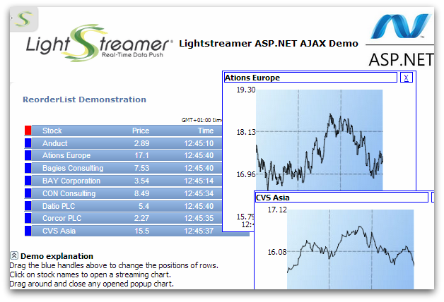

# Lightstreamer - Stock-List Demo - HTML (ASP.NET Ajax) Client

<!-- START DESCRIPTION lightstreamer-example-stocklist-client-aspnetajax -->

This project includes an integration demo of Lightstreamer and <b>Ajax Control Toolkit</b> for [Microsoft ASP.NET](http://ajax.asp.net/).

## Live Demo

 
### [ View live demo](http://demos.lightstreamer.com/AtlasDemo/) 

## Details

This application uses the <b>JavaScript Client API for Lightstreamer</b> to handle the communications with Lightstreamer Server and uses an [Ajax Toolkit ReorderList control](http://www.asp.net/ajaxlibrary/act_ReorderList.ashx) to display the data for eight stock quotes received from the server.
The [Ajax Toolkit DragPanel ](http://www.asp.net/ajaxlibrary/act_DragPanel.ashx) and [CollapsiblePanel](http://www.asp.net/ajaxlibrary/act_CollapsiblePanel.ashx) controls are also used in the demo. 
You can drag the blue handles to reorder the list. Click on the stock names to open pop-up boxes showing the streaming charts. 

The demo includes the following client-side functionalities:
* A [Subscription](https://lightstreamer.com/api/ls-web-client/latest/Subscription.html) for each of the eight stock quotes added to the update panel, subscribed to in <b>MERGE</b> mode feeding both a [StaticGrid](https://lightstreamer.com/api/ls-web-client/latest/StaticGrid.html) and, if opened, a [Chart](https://lightstreamer.com/api/ls-web-client/latest/Chart.html) for the pop-up window. 

### Dig the code

The example is comprised of the following source code and image files:
* `Default.aspx`(`.cs`): the Web form of the demo.
* `StyleSheet.css`: css file for the styles used in the demo.
* `web.config`: web configuration file.
* `js/*`: this folder contains all the JavaScript resources needed by the demo.
* `images/*`: this folder contains image files.
* `App_Code/*`: this folder contains source code for the xml data source.
* `App_Data/*`: this folder contains the xml file.

<!-- END DESCRIPTION lightstreamer-example-stocklist-client-aspnetajax -->

## Build

To build your own version of the demo, instead of using the one provided in the [Live Demo](https://github.com/Lightstreamer/Lightstreamer-example-StockList-client-aspnetajax#live-demo) section above, consider that to recompile the provided source, you just need to create a project for a <b>Web Application target</b>, then include the source and include references to the [Microsoft Ajax Toolkit](http://ajaxcontroltoolkit.codeplex.com/releases/) binaries files.
We have tested the demo with [Microsoft Visual Studio Express 2013 for Web](http://www.microsoft.com/en-us/download/details.aspx?id=40747).

Furthermore, before you can run the demo, some dependencies need to be solved:
* Get the `lightstreamer.min.js` file from [npm](https://www.npmjs.com/package/lightstreamer-client-web) or [unpkg](https://unpkg.com/lightstreamer-client-web/lightstreamer.min.js) and put it in the `/js` folder of the demo.
* Get the `require.js` file form the [requirejs.org](http://requirejs.org/docs/download.html) and put it in the `/js` folder of the demo.

In order to test your demo with Visual Studio and the pre-installed IIS Express web server please follow this step:

* Note that, as prerequisite, the [Lightstreamer - Stock- List Demo - Java Adapter](https://github.com/Lightstreamer/Lightstreamer-example-Stocklist-adapter-java) has to be deployed on your local Lightstreamer Server instance. Please check out that project and follow the installation instructions provided with it.
* Launch Lightstreamer Server.
* Recompile the <b>Visual Studio</b> solution of the demo (In <b>Solution Explorer</b>, right-click the name of the Web application project and then click <b>recompile</b>).
* Press <b>CTRL</b>+<b>F5</b> to run the page. To display a page in the browser you can also right-click the page in Solution Explorer and select <b>View in Browser</b> (please note you can choose the prefered browser to test).

## See Also

### Lightstreamer Adapters Needed by These Demo Clients

<!-- START RELATED_ENTRIES -->
* [Lightstreamer - Stock-List Demo - Java Adapter](https://github.com/Lightstreamer/Lightstreamer-example-Stocklist-adapter-java)
* [Lightstreamer - Reusable Metadata Adapters- Java Adapter](https://github.com/Lightstreamer/Lightstreamer-example-ReusableMetadata-adapter-java)

<!-- END RELATED_ENTRIES -->
### Related Projects

* [Lightstreamer - Stock-List Demos - HTML Clients](https://github.com/Lightstreamer/Lightstreamer-example-Stocklist-client-javascript)
* [Lightstreamer - Basic Stock-List Demo - jQuery (jqGrid) Client](https://github.com/Lightstreamer/Lightstreamer-example-StockList-client-jquery)
* [Lightstreamer - Stock-List Demo - Dojo Toolkit Client](https://github.com/Lightstreamer/Lightstreamer-example-StockList-client-dojo)
* [Lightstreamer - Basic Stock-List Demo - Java SE (Swing) Client](https://github.com/Lightstreamer/Lightstreamer-example-StockList-client-java)
* [Lightstreamer - Basic Stock-List Demo - .NET Client](https://github.com/Lightstreamer/Lightstreamer-example-StockList-client-dotnet)
* [Lightstreamer - Stock-List Demos - Flex Clients](https://github.com/Lightstreamer/Lightstreamer-example-StockList-client-flex)

## Lightstreamer Compatibility Notes

* Compatible with Lightstreamer JavaScript Client library version 6.0 or newer (installation instructions for version 8.0 or newer).
